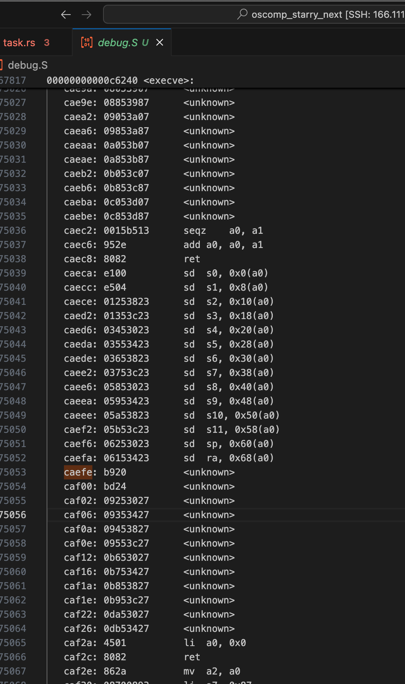

# 03/27 进展报告

## 贡献Starry Next文档

参与编写了Starry Next运行基本应用相关的文档，主要包括以下部分：

- 介绍基本应用的目录结构
- 如何运行基本应用
- 如何添加单文件源码/预编译二进制/完全自定义的应用

## 提交OS训练营测试

合并来自上游的代码后，将代码迁移到OS训练营仓库，提交测试。

有一个很浪费时间的事情是，基本测例在本地均可通过，但是提交上去后发现不能通过，全0分。推测可能是因为两者的评测脚本不同，后来发现必须在开始时输出 `"#### OS COMP TEST GROUP START basic-musl ####"`字样，部分同学是通过在内核的 `main`函数中硬编码这个输出的，这可能不是最佳做法。经我反复揣度测评脚本可能的行为之后，在 `testcase_list`上面和结尾分别添加了如下代码：

```bash
/musl/busybox echo "#### OS COMP TEST GROUP START basic-glibc ####"
/musl/busybox echo "#### OS COMP TEST GROUP START basic-musl ####"
# other testcases
/musl/busybox echo "#### OS COMP TEST GROUP END basic-musl ####"
/musl/busybox echo "#### OS COMP TEST GROUP END basic-glibc ####"
```

或许这个可能是合理的做法。

另外还得吐槽一句，评测平台是按照得分排名的，得分相同按提交时间排名。我一开始是按照上面的硬编码写的，然后提交上去得分了，后面改成下面这样，提交上去得分不变，但是因为提交更晚，排到了最后一名，真是滑稽。这个排名应该是取得分最高且最早的提交，而不是这么干。

## 进阶测例探索

目前上游仓库已经可以通过basic测例，那现在肯定得想想别的测例怎么搞。

观察发现，libc和busybox测例都是需要执行sh脚本测试，因此必须首先把 `busybox sh`跑起来。然后发现在riscv64平台上，`busybox sh`会直接报 `IllegalInstruction`异常，这个很离谱，我调了很久，也没发现可能的问题。最后还是通过这个Instruction本身入手，找郑学长分析，可能是他的工具链的问题，因为从生成的二进制文件本身反汇编，发现很多 `<unknown>`指令：



于是决定先换别的平台开发，先在x86_64上面测试，发现不会报非法指令了，然后执行发现没有实现 `fork`和 `pipe`这种关键的系统调用。这我就很迷惑了，因为基础测例里面有fork和pipe啊？然后执行一下，发现可能是libc力大飞砖，这两个系统调用都是拿write, read, open, wait这几个系统调用实现的，我愿称之为syscall界的riscv，大道至简啊。

别的不谈，目前首要目标还是真正意义上支持 `fork`等系统调用，以便可以支持 `busybox sh`的运行，这是后面其他测例能跑起来的基础。
